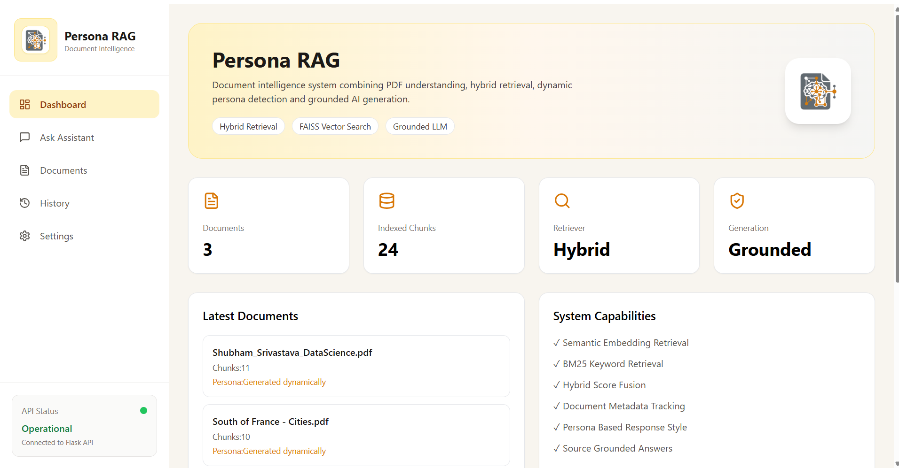
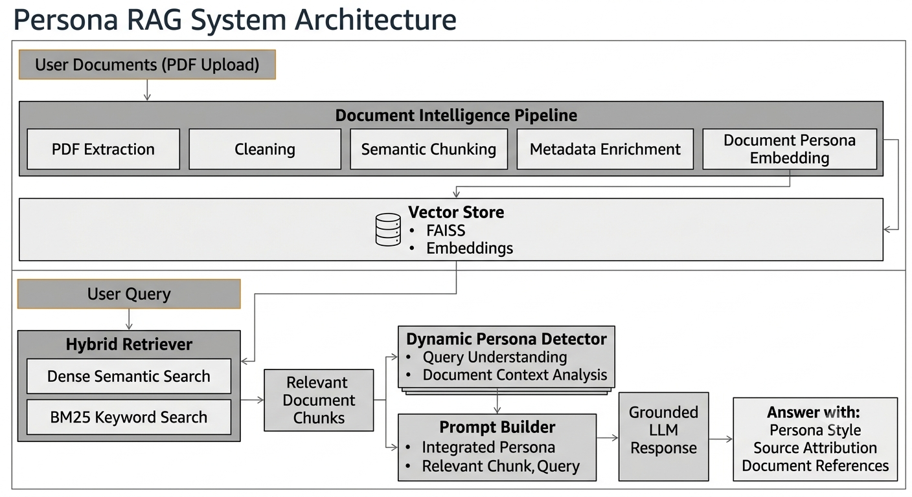
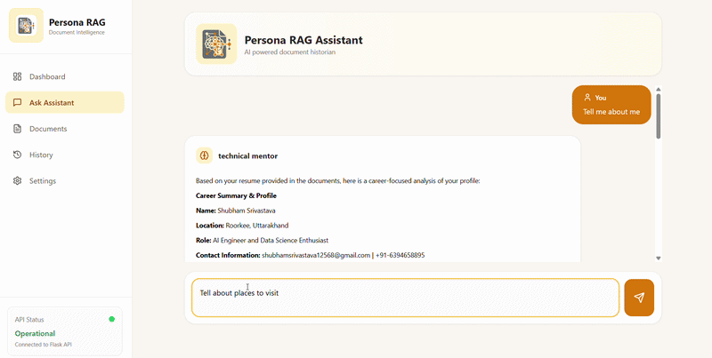
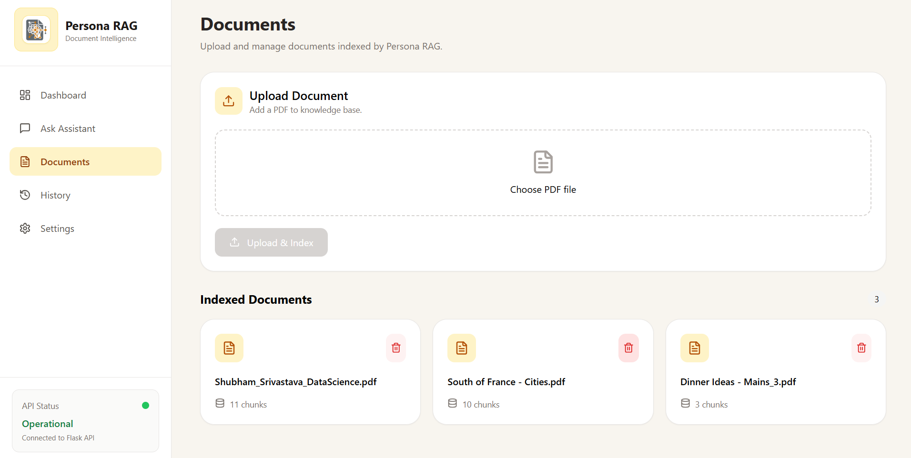
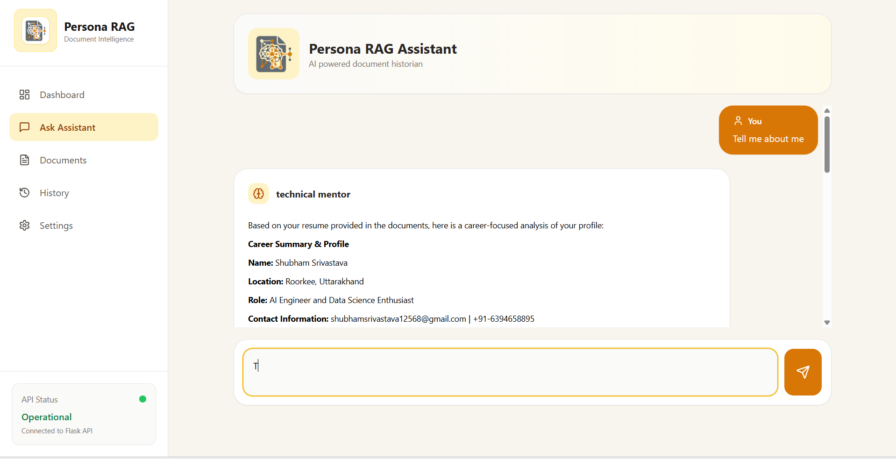
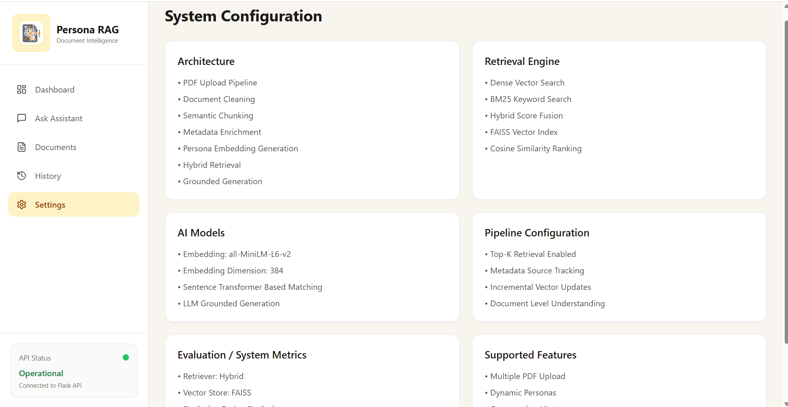

# 🧠 Persona RAG
## AI-Powered Document Intelligence System with Hybrid Retrieval & Dynamic Persona Generation





<p align="center">


</p>
Persona RAG transforms unstructured PDF documents into an intelligent knowledge system using semantic retrieval, keyword search, dynamic personas and grounded AI generation.
---

# 🚀 Overview

Persona RAG is an AI-powered document intelligence platform that transforms unstructured PDF documents into an interactive knowledge system.

The system combines:

- Document understanding
- Semantic embeddings
- Hybrid retrieval
- Persona-aware response generation
- Evidence-grounded answers


Instead of simply generating responses, Persona RAG retrieves relevant document knowledge and adapts the answer style according to the query context.

---

# ✨ Key Features


## 1. 📄 Intelligent Document Processing

The system automatically processes uploaded PDFs using:

- PDF extraction
- Text cleaning
- Semantic chunking
- Metadata enrichment
- Document indexing


### Processing Pipeline


```
PDF Upload

      ↓

Text Extraction

      ↓

Cleaning & Processing

      ↓

Semantic Chunking

      ↓

Embedding Generation

      ↓

FAISS Vector Storage
```

---

# 2. 🔎 Hybrid Retrieval Engine

Persona RAG uses a hybrid search architecture combining semantic and keyword-based retrieval.


## Dense Retrieval

Powered by:

```
all-MiniLM-L6-v2
```

Features:

- Semantic understanding
- Context similarity matching
- Meaning-based retrieval


## Keyword Retrieval

Powered by:

```
BM25
```

Features:

- Exact keyword matching
- Important term preservation


## Hybrid Ranking


```
Hybrid Score

=

Dense Similarity

+

BM25 Ranking
```


Benefits:

- Better recall
- Better precision
- Improved document grounding

---

# 3. 🧠 Dynamic Persona Engine


The system dynamically determines response style based on:

- User query
- Retrieved documents
- Context information


Example:


### User Query

```
Explain this research paper methodology
```


### Generated Persona

```
Research Analyst
```


Response characteristics:

- Technical explanation
- Structured analysis
- Paper-focused language


---


# 4. 🤖 Grounded AI Generation


Persona RAG follows evidence-based generation.

The model generates responses only from retrieved document information.


Features:

✅ Source attribution

✅ Context grounding

✅ Reduced hallucination

✅ Document references

# 🌐 Deployment

## Demo Version

A lightweight demo version of Persona RAG is deployed for demonstration purposes.

The deployed application uses a curated document collection and allows users to query the indexed documents.

Due to the resource requirements of document processing, embedding generation, and local AI models, the complete RAG pipeline is intended to run locally.

Demo deployment:

Frontend: https://persona-driven-document-analyst.vercel.app/dashboard

Backend API: https://persona-driven-document-analyst-3.onrender.com/

### Generation Pipeline


```
User Query

      ↓

Retriever

      ↓

Relevant Documents

      ↓

Persona Selection

      ↓

LLM Generation

      ↓

Final Answer + Sources
```

---

# 🏗️ System Architecture





---

# 🛠️ Technology Stack


## Frontend

| Technology | Purpose |
|---|---|
| React | User Interface |
| Vite | Frontend Build Tool |
| Tailwind CSS | Styling |
| Lucide React | Icons |
| React Markdown | Response Rendering |


---

## Backend

| Technology | Purpose |
|---|---|
| Flask | REST API |
| Python | Backend Logic |
| FAISS | Vector Database |
| BM25 | Keyword Retrieval |
| Sentence Transformers | Embedding Generation |


---

## AI Components

| Component | Model |
|---|---|
| Embedding Model | all-MiniLM-L6-v2 |
| Embedding Dimension | 384 |
| Retrieval | Dense + BM25 |
| Ranking | Hybrid Similarity Fusion |
| Generation | Grounded LLM Responses |

---

# ⚙️ System Configuration


| Component | Implementation |
|---|---|
| Document Processing | PDF Extraction + Semantic Chunking |
| Embedding Model | all-MiniLM-L6-v2 |
| Embedding Dimension | 384 |
| Vector Database | FAISS |
| Keyword Retrieval | BM25 |
| Similarity Search | Cosine Similarity |
| Retrieval Strategy | Hybrid Dense + Keyword |
| Chunking Strategy | Semantic Chunking |
| Generation Strategy | Evidence Grounded Responses |
| Backend API | Flask REST API |
| Frontend | React + Tailwind CSS |

# 🎥 Demo


Demo video:




---

# 📂 Project Structure


```
Persona-RAG/

│
├── Backend/
│
│   ├── modules/
│   │
│   │   ├── extraction/
│   │   ├── chunking/
│   │   ├── embeddings/
│   │   ├── retrieval/
│   │   └── prompting/
│   │
│   ├── data/
│   │
│   │   ├── uploads/
│   │   └── vector_store/
│   │
│   ├── app.py
│   └── requirements.txt
│
│
├── frontend/
│
│   ├── src/
│   │
│   ├── components/
│   ├── pages/
│   └── package.json
│
│
├── docs/
│
│   ├── screenshots/
│   │
│   └── demo.gif
│
└── README.md

```

---

# ⚙️ Installation


## Clone Repository


```bash
git clone https://github.com/yourusername/persona-rag.git

cd persona-rag
```

---

# Backend Setup


Move into backend:


```bash
cd backend
```


Create virtual environment:


```bash
python -m venv venv
```


Activate environment:


### Windows

```bash
venv\Scripts\activate
```


Install dependencies:


```bash
pip install -r requirements.txt
```


Run backend:


```bash
python app.py
```


Backend runs:


```
http://127.0.0.1:5000
```

---

# Frontend Setup


Open another terminal:


```bash
cd frontend
```


Install packages:


```bash
npm install
```


Run development server:


```bash
npm run dev
```


Frontend runs:


```
http://localhost:5173
```

---

# 📸 Screenshots


## Chatbot




## Working




## Settings




---


The demo shows:

1. Uploading PDF documents

2. Document indexing

3. Hybrid retrieval

4. Persona generation

5. Grounded answer generation


---

# 🔬 Future Improvements


Planned features:

- User authentication
- Multiple LLM providers
- Advanced evaluation metrics
- Conversation memory
- Document comparison mode
- Multi-modal document support
- Kubernetes based deployment


---

# 🎯 Why Persona RAG?


Traditional RAG systems:

```
Retrieve

+

Generate
```


Persona RAG adds another intelligence layer:


```
Retrieve

+

Understand

+

Adapt

+

Generate
```


Creating a more natural document interaction experience.

---

# 👨‍💻 Author


## Shubham Srivastava


shubhamsrivastava12568@gmail.com

# 📄 License


This project is licensed under the MIT License.

